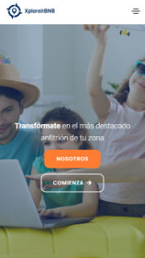
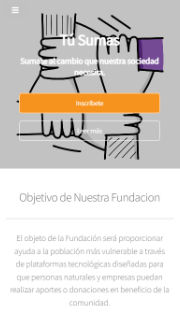
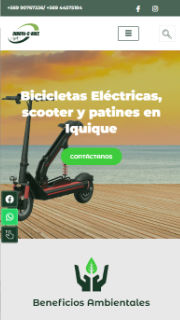
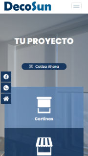
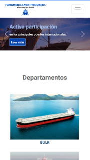
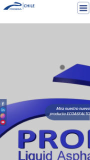
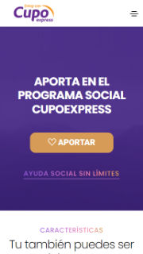

<h1 align="center"><b>Hi , I'm Felipe Andrés Parra </b></h1>

 

<h1 align="center"><b>Welcome to my profile </b>

Contents
========

 * [About me](#about-me)
 * [Academic Background](#academic-background)
 * [Skills](#skills)
 * [Projects](#projects)
 * [Github Stats](#github-stats)
 * [Let's Connect..!](#let's-connect..!)
 
 

## About me 

My name is Felipe Andrés Parra Álvarez, a passionate web developer with over 3 years of experience. In addition, I have served as a part-time field technician for tech advertising companies for more than 8 years. I've spent 13 years working as a sign language interpreter, where I provided invaluable support to the Deaf community. Throughout my career, I have honed my skills in video editing, mastering Adobe Premiere, After Effects, and Davinci Resolve. Venturing into the realm of digital marketing, I've established an agency that managed social media for up to 4 companies. 💼
 

## Academic Background 

- **Primary Education** (1996 - 2004)
    - Colegio Panal, Canal Chacao, Quilpué (1996 - 1997)
    - Colegio Fernando Duran Villarreal, Paradero 27, Quilpué (1998 - 1999)
    - Colegio Gastón Ossa Saint Marie, Viña del Mar (2000 - 2004)
    
- **Secondary Education** (2005 - 2008)
    - Colegio Técnico Profesional San Nicolás, Chacao, Quilpué
    
- **Iplacex** (2022)
    - Technician in Multiplatform Application Development

 

## Skills 
 

- **Languages**:
    
   
   
    
    
- **Front-End Development**:

   
   
   
   
   
 

- **Cloud Hosting**:

    
    
 

- **Softwares and Tools**:

    
    
    
    
     
 

- **Extras**:

    
     
    
     

 

-----

## 💡 Projects ✨

  

   

  

 

## Github Stats 
 

 

 

-----

## <b> Let's Connect..!</b>
 

<ul>

<li>

</li>
 

 

<li>

</li>
	
</ul>

### Este proyecto está bajo la licencia MIT. Para más información, consulta el archivo LICENSE.
